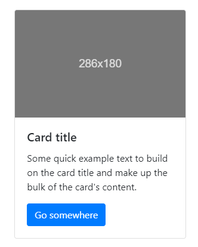

# [IoT 平台规划](https://github.com/Walkline80/IoT-Platform-Web/wiki)

上边的 wiki 懒得写了，直接列 plan 吧

# 更新计划

* 给小程序增加配网功能
	> mpy 没有 智能配网 和 airkiss 所以只能用原始的方法
	
	> 不准备推出硬件设备，所以贴二维码扫描配网也不可行
	
	* 我想的配网步骤是这样的
		1. 让设备进入配网模式
		2. 设备配网模式打开 ap 热点
		3. 用 ssid 标示出厂商和设备，密码可以使用硬件 id
		4. 小程序扫描 wifi 列表，根据 ssid 判断是否有可配网的设备
		5. 列出所有可配网的设备，用户选择其中之一
		6. 先填写本地 wifi 的 ssid 和密码，然后连接设备热点
		7. 连接设备热点后通过 socket 或任何方式将本地 wifi 信息保存到设备
		8. ~~设备复位，~~ 读取信息，用 sta 模式连接本地 wifi
		9. 连接成功后通知小程序，并关闭设备 ap 热点，完成配网
		10. 至于怎么通知，还没做呢，尚不清楚
		11. 重新配网的话从 第一步 重新开始，并删除保存的本地 wifi 信息

* 增加设备在线状态和在线时长统计功能
	* 在线状态通过判断上次设备更新状态信息的时间与当前时间的时间差，小于一定的时间判断为在线，否则为离线
	* 在线时长的统计稍微复杂一点：
		* 数据库表还需要增加一个字段，比如 online_date
		* 当设备更新状态信息时，判断设备之前是否为离线状态
		* 如果之前设备是离线的，就把当前日期时间写入 online_date
		* 需要统计时就判断当前日期时间和 online_date 的时间差即可

* 准备把平台全部功能都移植到小程序中，集中管理账号和设备等，因为做网页太烦了。。。。

* 设备列表展示最好用卡片的形式，上边设备图片，下边设备状态，加上几个控制按钮什么的

* 其它的东西等想到了再添加吧
